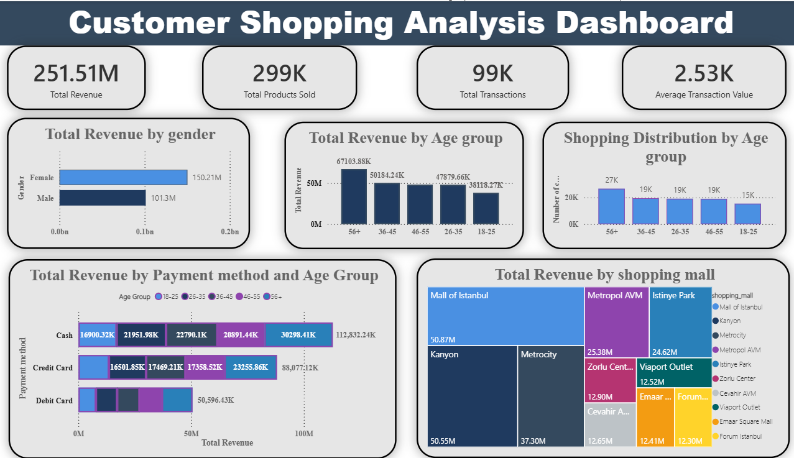

# 🛒 Customer Shopping Data Analysis

An end-to-end Data Analytics project that analyzes customer shopping behavior using **SQL**, **Power BI**, **Power Query**, and **DAX**. The project uncovers customer demographics, purchasing patterns, revenue trends, and payment preferences through an interactive dashboard.

---

## 📌 Project Overview

This project analyzes customer shopping data to help businesses understand:

- Customer shopping behavior
- Revenue by gender and age
- Product category performance
- Payment method preferences
- Business insights for better decision making

---

## 🎯 Objectives

- Analyze customer shopping behavior by gender and age.
- Identify high-revenue product categories.
- Compare products sold across customer segments.
- Study customer payment method preferences.
- Build an interactive Power BI dashboard.

---

## 🛠️ Tools & Technologies

- SQL (MySQL)
- Power BI
- Power Query
- DAX
- Microsoft Excel

---

## 📂 Dataset Information

| Feature | Description |
|----------|-------------|
| Source | MySQL Database |
| Total Records | 99,457 |
| Fields | Invoice No, Customer ID, Gender, Age, Category, Quantity, Price, Payment Method, Invoice Date, Shopping Mall |

---

## 📊 Dashboard Features

- Shopping Distribution by Gender
- Products Sold by Gender
- Revenue by Gender
- Products Sold by Category & Gender
- Shopping Distribution by Age
- Products Sold by Age
- Revenue by Age
- Revenue by Category & Payment Method
- Payment Method Analysis
- Business Recommendations

---

## 📈 Key Insights

- Female customers generated the highest revenue and shopping transactions.
- Customers aged 56+ are the most valuable customer segment.
- Clothing is the highest-selling and highest-revenue category.
- Cash is the most preferred payment method.
- Customers aged 18–25 contribute the least revenue, presenting an opportunity for targeted marketing.

---

## 💡 Business Recommendations

- Increase marketing campaigns for female customers.
- Introduce loyalty programs for customers aged 56+.
- Increase inventory for Clothing, Shoes, and Technology.
- Offer discounts and digital campaigns for younger customers.
- Promote digital payments through cashback and rewards.

---

```


## 🚀 Skills Demonstrated

- Data Cleaning
- SQL Query Writing
- Data Modeling
- DAX Measures
- Power Query Transformation
- Data Visualization
- Business Intelligence
- Dashboard Design
- Business Insights

---

## 👤 Author

**Deepak R**

